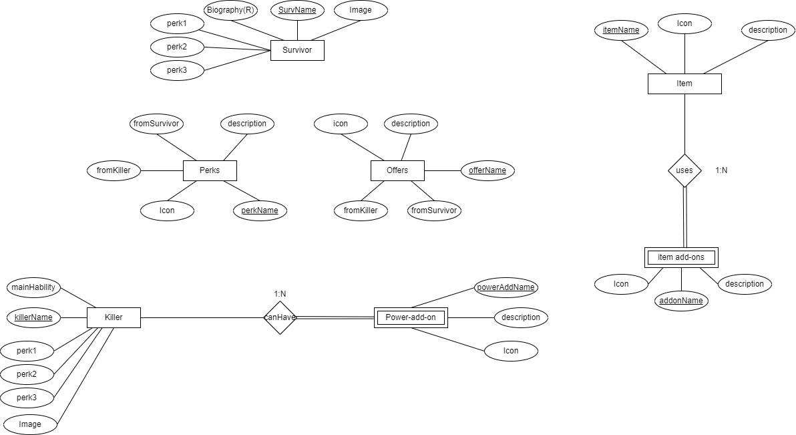

<h1 align="center">
   
  
     
    🤖Dead by Daylight Randomizer🤖
     
    by NopeIsDope
</h1>

A randomizer for the game Dead By Daylight (DBD) that allows you to play with random perks, add-ons, offerings, and more!
The name of the proyect its provisional, it can change in the future.

<h2 align="center">This bot is currently in development and is not yet ready for use!!!.</h2>

## **Table of Contents📋**

## **How to use📒**
1. When the bot is added to your server, type `!dbd` to get a list of commands.
2. Type `!dbd help` to get a list of commands.
3. Type `!dbd help <command>` to get more information about a specific command.
4. Type `!dbd <command>` to use a command.

## **Commands⌨️**
ALL OF THEM STARTS WITH `!dbd <command>`

### **General**
- `dbd about <command>` - Get information about a command. (Commands with a second argument aren't available at the moment.) 

- `help` - Get an introduction to the bot
- `commands` - Get a list of commands
- `randomPerk` - Get a random perk
- `randomPerks` - Get a list of random perks
- `randomAddOn` - Get a random add-on
- `randomAddOns` - Get a list of random add-ons
- `randomOffering` - Get a random offering
- `randomSurvivor` - Get a random survivor
- `randomKiller` - Get a random killer
- `perk survivor` - Get a random perk from the survivors with the information about it.
- `perk killer` - Get a random perk from the killers with the information about it.
- `addon` - Get a random add-on with the information about it.
- `offering` - Get a random offering with the information about it.
- `survivor` - Get a random survivor
- `killer` - Get a random killer
- `survivor <name>` - Get information about a specific survivor (pending)
- `killer <name>` - Get information about a specific killer (pending)
- `survivorlist` - Get a list of all survivors
- `killerlist` - Get a list of all killers
- `perkCombos survivor` - Get a random perk combo of 4 perks to use on a survivor
- `perkCombos killer` - Get a random perk combo of 4 perks to use on a killer
- `preMatch survivor` - Get a random pre-match lobby setup (including 4 perks (from the survivors), 1 item (with 2 add-ons), 1 offering, and 1 survivor)
- `preMatch killer` - Get a random pre-match lobby setup (including 4 perks (from the killers), 1 item (with 2 add-ons), 1 offering, and 1 killer)
- `item` - Get a variety-random item (f.e medkit, toolbox, etc.) with the information about it. (pending)
    for example: `!dbd item` : green toolbox and it info
- `item <color>` - Get a random item (f.e medkit, toolbox, etc.) with the color you specified (pending)
    for example: `!dbd item green` : green toolbox and it info

--coming soon--

- `itemlist` - Get a list of all items (f.e medkit, toolbox, etc.) (pending)
- `authors` - Get a list of all authors of the bot with its favorite perk, survivor, killer, item and its github link
- `sugeredPerkCombos` - Get a random sugered perk combo of 4 perks to use
- `randomObjetive` - Get a random objetive to do in the match
        -Example: `!dbd randomObjetive` : "do 4 beamer saves in a match" (easy to do in the tutorial of discord bot (inspirational messages))

## **Entity Relationalship Diagram (ERD)📊**
#### *Final Version*

## **Support📞**

  
Click to expand!

  
  If you need help with the bot, you can contact me on Discord: `NopeIsDope#0001`

  You can also join the support server: [Click here](https://discord.gg/4Z7Z9Z9)

  I'm also open to suggestions, so if you have any, you can contact me on Discord or join the support server and tell me there.

  You can contact with the other authors of the bot on Discord (click on the authors command to get their Discord tag).

## **Credits📝**
- [DeadByDaylight](https://deadbydaylight.com/) - The game Dead By Daylight
- [DeadByDaylight Wiki](https://deadbydaylight.gamepedia.com/Dead_by_Daylight_Wiki) - The wiki for the game Dead By Daylight
- [DeadByDaylight API]() - The API for the game Dead By Daylight    

## **Authors👨‍💻**
- [Iker Morán](https://github.com/IkerKa) - The main author of the bot
### **Contributors**
- [Juan Carrasquer](https://github.com/fortaleza2001) - (pending)
- [Darío Marcos](//gitlink) - (pending)

## **License📜**
This project is under the MIT License - see the [LICENSE.md](LICENSE.md) file for details
If you want to use this code, please give credits to the authors. Thanks! :) 

## **Disclaimer⚠️**
This bot is not affiliated with Dead By Daylight or Behaviour Interactive in any way. All trademarks are the property of their respective owners.
At this moment the bot will be for personal use.

## **Changelog📝**

  
Click to expand!

  
### **vPre-0.0.0**
Brainstorming and planning the project.

### **vPre-0.0.1**
Created the repository and the README.md file.

### **vPre-0.0.2**
Created the ERD and added it to the README.md file.
SQL database created.

### **vPre-0.0.1.2**
Added the license to the README.md file.
Programmed the commands `!dbd about <command>` and `!dbd help <command>`.
At the moment commands with a second argument aren't available.

### **vPre-0.0.2**
Programmed the commands `!dbd help` and `!dbd commands`.
Added new commands ideas to the README.md file.

### **vPre-0.0.3**
Added Iker and Juan selected setup command

### **vPre-0.0.4**
First commit to the repository.
Added the bot to the support server.
Added the github link to the README.md file.

### **vPre-0.0.5**
Brainstorming to take the data from the wiki.

### **vPre-0.0.6**
Start scraping the wiki.

### **vPre-0.1.0**
Scraped all perks data from the wiki.

### **vPre-0.1.0.1**
Scraped all add-ons data from the wiki.
Scraped all offerings data from the wiki.
Scraped all the items data from the wiki.
Scraped all the people data from the wiki.

### **vPre-0.1.1**
All data scrapped from the wiki.

### **vPre-0.2.0**
Sql files created.
Formatted the files and making the workspace structured.

### **vPre-0.2.1**
Checking the sql inserts (1st check: SQL number of entries is correct)

### **vPre-0.2.1.1**
Checking the sql inserts (order of insertion as the creation of the tables in progress..)

## **Contributing🤝**
This is actually a non-profit project and also a private project, so currently I'm not accepting contributions 😢.

## **Donate🤑**
**No!** This is a non-profit project and also a private project, so we don't accept any donations.

## **Acknowledgments🎁**