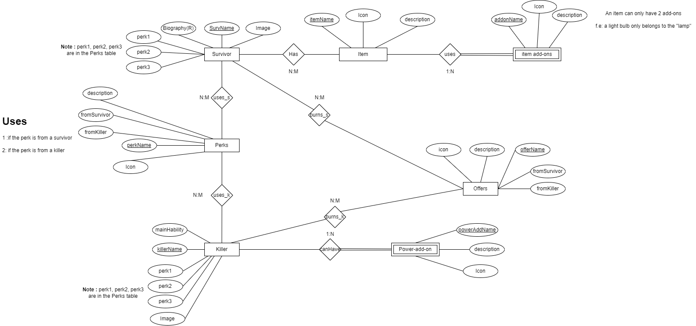

# dbdRandomizer
A randomizer for the game Dead By Daylight (DBD) that allows you to play with random perks, add-ons, offerings, and more!

## How to use
1. When the bot is added to your server, type `!dbd` to get a list of commands.
2. Type `!dbd help` to get a list of commands.
3. Type `!dbd help <command>` to get more information about a specific command.
4. Type `!dbd <command>` to use a command.

## Commands
ALL OF THEM STARTS WITH `!dbd <command>`

### General
- `dbd about <command>` - Get information about a command. (Commands with a second argument aren't available at the moment.) 

- `help` - Get an introduction to the bot
- `commands` - Get a list of commands
- `perk survivor` - Get a random perk from the survivors with the information about it.
- `perk killer` - Get a random perk from the killers with the information about it.
- `addon` - Get a random add-on with the information about it.
- `offering` - Get a random offering with the information about it.
- `survivor` - Get a random survivor
- `killer` - Get a random killer
- `survivor <name>` - Get information about a specific survivor (pending)
- `killer <name>` - Get information about a specific killer (pending)
- `survivorlist` - Get a list of all survivors
- `killerlist` - Get a list of all killers
- `perkCombos` - Get a random perk combo of 4 perks to use
- `preMatch survivor` - Get a random pre-match lobby setup (including 4 perks (from the survivors), 1 item (with 2 add-ons), 1 offering, and 1 survivor)
- `preMatch killer` - Get a random pre-match lobby setup (including 4 perks (from the killers), 1 item (with 2 add-ons), 1 offering, and 1 killer)
- `item` - Get a variety-random item (f.e medkit, toolbox, etc.) with the information about it. (pending)
    for example: `!dbd item` : green toolbox and it info
- `item <color>` - Get a random item (f.e medkit, toolbox, etc.) with the color you specified (pending)
    for example: `!dbd item green` : green toolbox and it info

--coming soon--

- `itemlist` - Get a list of all items (f.e medkit, toolbox, etc.) (pending)
- `authors` - Get a list of all authors of the bot with its favorite perk, survivor, killer, item and its github link
- `sugeredPerkCombos` - Get a random sugered perk combo of 4 perks to use
- `randomObjetive` - Get a random objetive to do in the match
        -Example: `!dbd randomObjetive` : "do 4 beamer saves in a match" (easy to do in the tutorial of discord bot (inspirational messages))

## Entity Relational Diagram
#### Final Version

## Support
If you have any questions or suggestions, feel free to join the [support server]()!

## Credits
- [DeadByDaylight](https://deadbydaylight.com/) - The game Dead By Daylight
- [DeadByDaylight Wiki](https://deadbydaylight.gamepedia.com/Dead_by_Daylight_Wiki) - The wiki for the game Dead By Daylight
- [DeadByDaylight API]() - The API for the game Dead By Daylight    

## Authors
- [Iker Morán](//gitlink) - The main developer of the bot aka (nickname)
### Co-authors
- [Juan Carrasquer](//gitlink) (nickname)
- [Darío Marcos](//gitlink) (nickname)

## License
This project is licensed under the MIT License - see the [LICENSE.md](LICENSE.md) file for details
If you want to use this code, please give credits to the authors. Thanks! :) 

## Disclaimer
This bot is not affiliated with Dead By Daylight or Behaviour Interactive in any way. All trademarks are the property of their respective owners.
At this moment the bot will be for personal use.

## Changelog
- 1.0.0 - Initial release
- 1.0.1 - Added `!dbd help` command
- 1.0.1.2 - Added `!dbd about <command>` command (only commands with one parameter)
- 1.0.2 - Added `!dbd commands` command
- 1.0.3 - ER Diagram added

## To-do

- [ ] Add more commands
- DO THE DATABASE
- [ ] Add more information about the items
- [ ] Add more information about the perks
- [ ] Add more information about the add-ons
- [ ] Add more information about the offerings
- [ ] Add more information about the survivors
- [ ] Add more information about the killers

## Contributing
This is actually a non-profit project and also a private project, so we don't accept any contributions.

## Donate
No! This is a non-profit project and also a private project, so we don't accept any donations.

